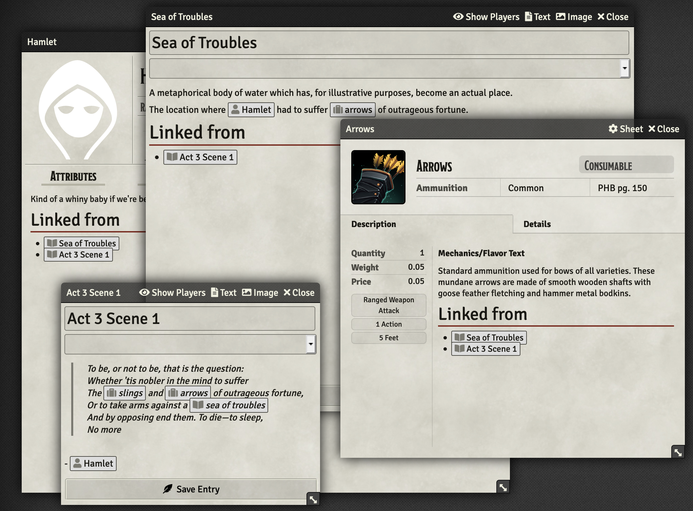

# journal-backlinks
A module for Foundry VTT that links entities (journal entries, actors and items) that reference each other. Continuing the work of the abandoned [journal-links](https://github.com/Sigafoos/journal-links).

"Have we interacted with this faction before?"

"Do these characters have a relationship?"

"Has this item been seen in a few different places?"

This module adds wiki-style "referenced by" links to journals, actors and items, allowing easy browsing. It doesn't change the actual text of the journal/bio/etc, but displays it as though it was part of the entry!

## Installing
Add the manifest to your Foundry modules: https://raw.githubusercontent.com/jtracey/journal-backlinks/master/module.json

(automatic discovery/install in Foundry itself coming soon)

## Linking entities
In general the linking should happen automatically: this module detects that it hasn't ever run and will run an initial sync. Whenever you save an entity (journal entry, actor bio, item description) it will detect all entities linked in the text and link them if the "Rebuild on save" setting is enabled (there shouldn't be a reason to disable it, as I don't anticipate performance issues, but it's included just in case).

If you've disabled "Rebuild on save" (or just feel like it), in the module settings you can click the 'Sync now' button to perform a sync.

The module may perform additional automatic syncs after an update which fixes a bug, etc.

## Settings
* **Rebuild on save**: if disabled, won't automatically generate links between entities (default: enabled)
* **Heading tag**: by default it uses `<h1>` tags for the section. If you'd like to change it to `<h2>`, etc, you can (note: this doesn't support custom classes, attributes, etc)
* **Minimum permission**: change this to set the minimum permission level a user must have before being able to see a backlink to that entity
* **Debug**: will print more detailed information about the linking process in the developer console (default: disabled)

